<!-- Typing SVG -->
<div align="center">
  
</div>

<br/>

---

## `> whoami`

```python
class Okarin:
    def __init__(self):
        self.nome       = "Matheus dos Santos Tenório"
        self.nickname   = "Okarin"
        self.foco       = ["Back-end", "Front-end", "UI/UX Design"]
        self.linguagens = ["Python", "Java", "JavaScript", "HTML", "CSS"]
        self.estado     = "Sempre aprendendo 🚀"

    def missao(self):
        return "Transformar café em código e código em experiências."
```

---

## 🛠️ Tech Stack

### Back-end


### Front-end & UI/UX


### Tools


---

## 🎨 UI/UX — O lado criativo do código

> *"A melhor interface é aquela que o usuário nem percebe que está usando."*

Além de codar, curto muito pensar na **experiência do usuário** — cores, tipografia, fluxo de navegação. Acredito que bom design e bom código andam juntos, e é essa combinação que faz um produto realmente se destacar.

---

## 📊 GitHub Stats

<div align="center">
  
  
</div>

---

## 🌐 Onde me encontrar

<div align="center">

[](https://www.linkedin.com/in/matheus-dos-santos-ten%C3%B3rio-2a2853235/)

</div>

---

<div align="center">
  
  <br/>
  <sub>Made with 💙 and lots of ☕ by Okarin</sub>
</div>
